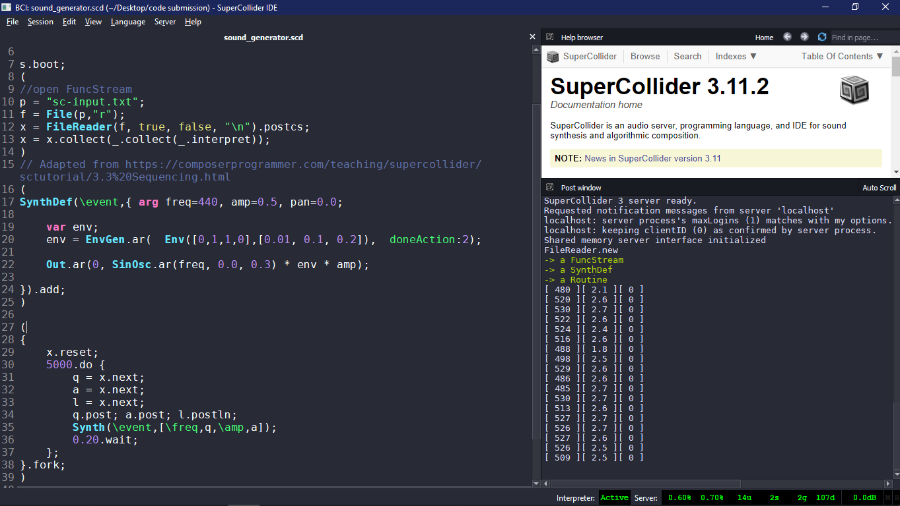
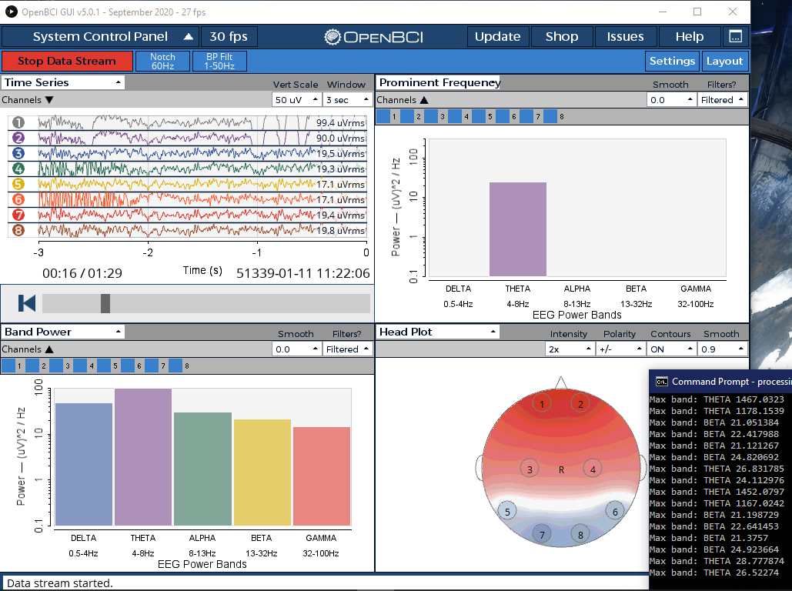

# music-BCI
The project was designed with OpenBCI's Ultracortex Mark IV in mind. The aim is to allow subjects to wear the headset and be able to 'think' their way into influencing the sound they produce on the music synthesiser. An AE is used to classify different mental states. 
However, as a result of the pandemic, the headset could not be obtained for testing. 

In this experiment, the programmes used were:
- OpenBCI GUI v5.0.1
- SuperCollider-3.11.2

The EEG dataset [1] for training [2] involves four subjects in three different mental states (concentrating, relaxed, neutral). 


## Generating sound
This project requires [SuperCollider](https://supercollider.github.io/download) to run.  

In this root folder you will find the main file for generating sound, [sound_generator.scd](https://github.com/jolenefoong/music-BCI/blob/main/sound_generator.scd), and a sample file converted from EEGs, [sc-input.txt](https://github.com/jolenefoong/music-BCI/blob/main/sc-input.txt). The file was sorted by mental state.  
  
SuperCollider interface

##### Booting the audio server and playing sound
Each line in SuperCollider is run line by line, or in blocks encased by parentheses. Boot the audio server by running the single line ```s.boot;``` with the pointer on any region of the line using Shift+Enter. Once the server is up and running, load in the blocks by clicking anywhere within their parentheses with Ctrl+Enter.

##### Troubleshooting: the audio server cannot boot
- stop SC, confirm sclang/scide/scsynth are down with TaskManager
- Open Event Viewer, delete all application and system logs
- Open powershell as administrator, add a 6005 event: ```write-eventlog -logname System -source 'EventLog' -EventID 6005 -EntryType Information -Category 0 -message "foobar"```
- Restart SC

##### OpenBCI GUI
In the /old directory, it contains an implemented W_ProminentFrequency.pde for visualising the current frequency that is most prominent. Original code for the OpenBCI GUI is from  https://github.com/OpenBCI/OpenBCI_GUI, and requires [Processing](https://docs.openbci.com/docs/06Software/01-OpenBCISoftware/GUIDocs) to run as a sketch.

Demonstrating prominent frequency


### References
[1] J. J. Bird, L. J. Manso, E. P. Ribiero, A. Ekart, and D. R. Faria, “A study on mental state classification using eeg-based brain-machine interface,”in 9th International Conference on Intelligent Systems, IEEE, 2018.

[2] ‘eeg-feature-generation/dataset/original_data at master · jordan-bird/eeg-feature-generation’, GitHub. https://github.com/jordan-bird/eeg-feature-generation (accessed Sep. 16, 2021).
